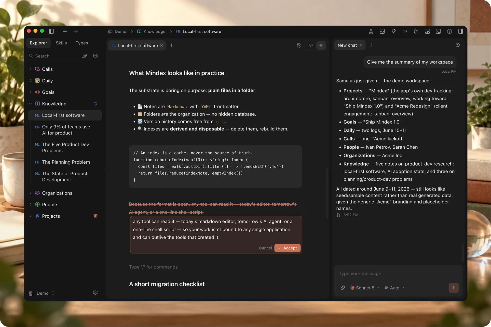

[](https://github.com/gixp/mindex/releases/latest)
[](https://github.com/gixp/mindex/actions/workflows/release.yml)

# Mindex — an open-source IDE for your knowledge, on your AI subscription

Mindex is a desktop app for macOS, Windows and Linux for **markdown knowledge
bases**, run by the AI subscription you already pay for. People use it to:

- 🧠 Keep a second brain in plain files
- 📚 Hand company docs to an assistant
- 🧭 Give that assistant a lasting memory
- 🗂️ Run projects, calls and decisions

Personally, I build my company and my life in it (hi 👋 [Dmitriy
here](https://www.linkedin.com/in/dvolynov/)) — one vault for the work, one for
everything else. Mindex is written inside itself.

<br />



<br />

## Principles

- 📄 **Plain files.** Markdown and YAML, no database, no export step.
- 🔌 **Your own assistant.** Claude Code, Codex or Gemini CLI, on your
  subscription. Mindex holds no API key.
- 🔒 **Local-first.** No account, no server, nothing uploaded.
- 🌱 **Context that keeps itself.** A background job maintains one context file
  per folder, in the name your assistant reads natively.
- 🕓 **Nothing is lost.** Local version history on every write, and Git built in.
- 🏷️ **Types are lenses, not schemas.** They change what you see, never what
  you may write.
- ⌨️ **Keyboard-first.** A command palette, and shortcuts for the rest.
- 🔓 **Open source.** AGPL-3.0, free, and yours to fork.

## What it does

**Writes with you.** A rich editor and the raw file, side by side or one at a
time. Wiki links, backlinks, a graph, typed notes, comments.

**Answers in your vault.** A chat that can search, read and write your notes.
Set how far a question reaches — this note, this folder, everything — and where
the answer lands: the chat, the note, or a Word, Excel, PDF or Markdown file.

**Interrupts politely.** Send another message mid-answer and it stops and takes
the new one, rather than queueing behind an answer going the wrong way.

## What you need

One assistant CLI, installed and signed in:

| Assistant   | Install                                    | Sign in  |
| ----------- | ------------------------------------------ | -------- |
| Claude Code | `npm install -g @anthropic-ai/claude-code` | `claude` |
| Codex       | `npm install -g @openai/codex`             | `codex`  |
| Gemini CLI  | `npm install -g @google/gemini-cli`        | `gemini` |

Mindex drives whichever you have and never asks for an API key of its own. A
setup screen checks on first launch, and can install one for you.

## Install

Download from [mindex.live/download](https://mindex.live/download) or the
[releases page](https://github.com/gixp/mindex/releases/latest).

| Platform              | File                                      |
| --------------------- | ----------------------------------------- |
| macOS (Apple Silicon) | `Mindex-<version>-arm64.dmg`              |
| Windows (x64)         | `Mindex-Setup-<version>.exe`              |
| Linux (x64)           | `Mindex-<version>-x64.AppImage` or `.deb` |

Builds are not yet signed with an Apple certificate, so macOS asks once:
right-click the app, choose Open, then Open again.

## Build from source

Node 20 or newer.

```bash
git clone https://github.com/gixp/mindex.git
cd mindex
npm ci
npm run dev
```

Other commands: `npm run typecheck`, `npm test`, `npm run lint`,
`npm run build`. Packaged installers come from `npm run release:mac`,
`release:win` or `release:linux`.

A build from a clone has no analytics or crash-reporting keys, and every one of
those integrations turns itself off when its key is blank.

## Asking for things

Feature requests and questions go to
[Discussions](https://github.com/gixp/mindex/discussions). Bugs go to
[Issues](https://github.com/gixp/mindex/issues).

The app also has a report form of its own, under Help. That one goes to the
crash reporter rather than to this repository, and it never sends anything from
your notes — use it when you would rather not write in public, and Issues when
you would.

## Licence

[AGPL-3.0-or-later](LICENSE). The name and logo are covered separately, see
[TRADEMARK.md](TRADEMARK.md).
